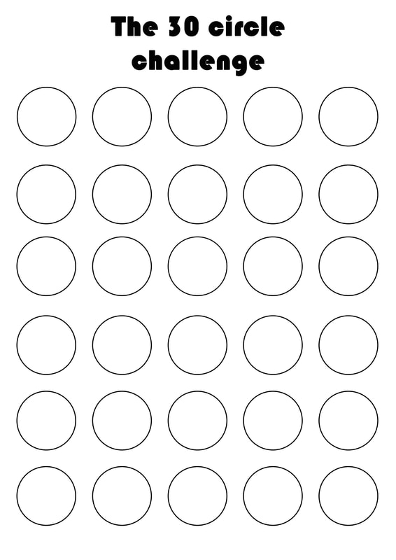

```{r setup, include=FALSE}
knitr::opts_chunk$set(echo = TRUE)
```

## Nature cognition and creativity  
 

### Data  
The [30-circle visual creativity test](https://www.ideo.com/blog/build-your-creative-confidence-thirty-circles-exercise) was used to explore the influence of a short, defocussed nature experience. A sheet with 30 empty circles was provided to each participant. Instructions were provided. Specifically, turn each circle into a picture, as many as you can, within one minute. The test was adminstered to a total of 20 participants before and after a timed 10-minute walk outside in a [greyfield](https://en.wikipedia.org/wiki/Greyfield_land) open space. It was 60F and sunny on January 11, 2020. Participants were encouraged to wander, do quiet exploration, or examine nature. Testing was done indoors pre and post intervention. Participants also provided an estimate of the total duration spent outdoors from Monday to Friday weekly. The total number of circles completed in each was recorded by CJL. The creativity of each sheet was then assigned a composite score using a Likert Scale from 1 to 5. A score of 1 being limited creativity and 5 being exceptionally creative. Creativity was assessed based on visual clarity, effective circle use, detail, and the extent that each picture communicated a concept. No respondent identity attributes were recorded.      

  

```{r data, warning=FALSE, message=FALSE}
library(tidyverse)
data <-  read_csv("data/data.csv")
wide_data <- data %>%
  pivot_wider(names_from = treatment, values_from = c(n_circles, creativity_score))

wide_data <- wide_data %>%
  mutate(relative_difference_n = (n_circles_after - n_circles_before)/(n_circles_after + n_circles_before), relative_difference_creativity = (creativity_score_after - creativity_score_before)/(creativity_score_after + creativity_score_before)) 

simple_data <- wide_data %>%
  select(duration_outside, relative_difference_n, relative_difference_creativity) %>%
  rename(n = relative_difference_n, creativity = relative_difference_creativity) %>%
  pivot_longer(-duration_outside, names_to = "measure", values_to = "relative_difference")

data
```

### Visualization

```{r viz, warning=FALSE, message=FALSE}
ggplot(data, aes(n_circles, fill = treatment)) +
  geom_density(alpha = 0.7) +
  scale_fill_brewer(palette = "Paired")

ggplot(data, aes(creativity_score, fill = treatment)) +
  geom_density(alpha = 0.7) +
  scale_fill_brewer(palette = "Paired")

#ggplot(wide_data, aes(relative_difference_n)) +
  #geom_density(alpha = 0.7, fill = "lightblue") 

ggplot(data, aes(reorder(treatment, n_circles), n_circles)) +
  geom_boxplot() +
  labs(x = "treatment", y = "number of circles completed")

ggplot(data, aes(reorder(treatment, creativity_score), creativity_score)) +
  geom_boxplot() +
  labs(x = "treatment", y = "net creativity score")

ggplot(simple_data, aes(duration_outside, relative_difference, color = measure)) +
  geom_point() +
  geom_smooth() +
  scale_color_brewer(palette = "Paired") +
  labs( x = "weekly reported duration outside in hrs", y = "weighted relative difference after-before") +
  ylim(0, 0.5) +
  xlim(0, max(simple_data$duration_outside))

```

### Models
```{r models, warning=FALSE, message=FALSE}
t.test(wide_data$relative_difference_n, mu = 0)
t.test(wide_data$relative_difference_creativity, mu = 0)

m1 <- glm(relative_difference~duration_outside * measure, data = simple_data)
#summary(m1)
anova(m1, test = "Chisq")

```

### Interpretation
1. A short non-directed, outdoor experience significantly enhanced visual creativity.  
2. The number of circles completed was more responsive to nature than creativity. 
3. The weekly reported duration outside did not predict the effect of nature on visual creativity (as estimated using this test and design). However, the two measures did differ by duration outside.  
4. Individuals that reported less time outside responded more positively to the short duration outside relative to individuals that reported relatively more time outdoors weekly.  

**Nature deficit disorder antidote: a short 10-min break outside followed by a hands-on challenge to be more creative.  **